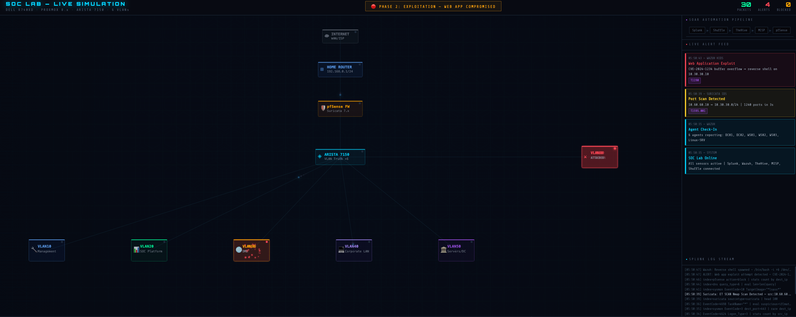

# Enterprise SOC Detection Lab

## Overview
This lab simulates an enterprise Active Directory environment to develop and test security detections using Splunk.

## Lab Architecture

## Attack Simulations
Kerberoasting
Pass-the-Hash
PowerShell abuse
Lateral movement

## Detection Engineering
Behavior-based detections written in SPL.

## Threat Hunting
Hypothesis-driven threat hunting queries.

## SOC Dashboards
Screenshots of monitoring dashboards.

## MITRE ATT&CK Coverage
Table mapping detections to ATT&CK techniques.

## Skills Demonstrated
Detection Engineering
Threat Hunting
SIEM Engineering
Incident Investigation
Windows Security Logging
